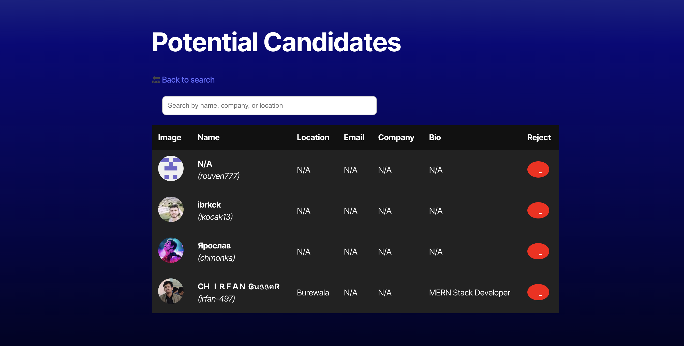

# Candidate Search - Module 13 Challenge

A TypeScript + React app that allows employers to browse potential candidates using GitHub’s public user API. You can accept or reject candidates, and your saved list is persisted with localStorage.

## 🚀 Live Demo

👉 [Click here to view the app on Render](https://your-app-name.onrender.com)

## 


## 🧠 Features

- 🔎 Fetches GitHub users randomly
- ➕ Accept candidates and save them
- ➖ Reject candidates and move on
- 💾 Saves accepted candidates in localStorage
- 🧹 Option to remove saved candidates
- 🔍 Search filter in saved list
- 📱 Responsive design

## 🛠 Tech Stack

- React
- TypeScript
- React Router DOM
- GitHub API
- Vite

## 📦 Installation

```bash
npm install
npm run dev